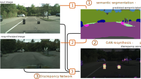

# Detecting the Unexpected via Image Resynthesis
Krzysztof Lis, Krishna Nakka, Pascal Fua, Mathieu Salzmann
**ICCV 2019**

[[article]](http://openaccess.thecvf.com/content_ICCV_2019/papers/Lis_Detecting_the_Unexpected_via_Image_Resynthesis_ICCV_2019_paper.pdf)
 [[poster]](https://liskr.net/pub/DetectingTheUnexpected_Poster.pdf)



## Installation

```bash
git clone https://github.com/cvlab-epfl/detecting-the-unexpected --recursive
```

Install libraries:
```bash
pip install numpy opencv-python-headless matplotlib h5py natsort imageio torch torchvision scipy tqdm tensorboard future ipython
```

To run notebook files:
```bash
pip install jupyterlab
```

## Trained weights

Download [weight files [2 GiB]](https://drive.switch.ch/index.php/s/xywBQNLoDxBVuxe/download)
and place them in `detecting-the-unexpected/exp` (or another location specified with env variable `DIR_EXPERIMENTS`).

## Directory structure

`detecting-the-unexpected`
* `src`
  * `a01_sem_seg` - semantic segmentation
  * `a04_reconstruction` - image synthesis from labels
  * `a05_differences` - discrepancy detector
  * `a05_road_rec_baseline` - the RBM autoencoder baseline method
* `exp` - trained weights (override location with env variable `DIR_EXPERIMENTS`)
  * `0120_BayesSegNet_BDD`
  * `0405_pix2pixHD512_nostyle_ctc_crop`
  * `0521_Diff_SwapFgd_ImgAndLabelVsGen_semGT`
  * ...
* `datasets` - or another location specified by env variable `DIR_DSETS`
  * `dataset_RoadAnomaly` - our dataset, [download here](https://www.epfl.ch/labs/cvlab/data/road-anomaly/)
  * `dataset_LostAndFound/1024x512` - [Lost and Found](http://www.6d-vision.com/lostandfounddataset) but [downscaled](#dataset-processing) by a factor of 2
* `data`
  * `joint_pipeline_example` - a few images from *Lost and Found*, to demonstrate the joint pipeline
  * `out` - default output location of the joint pipeline
  * `discrepancy_dataset/cityscapes` - synthetic discrepancy datasets
	* `051X_semGT__fakeSwapFgd__genNoSty` - place our discrepancy dataset here. [[0521_synthetic_discrepancy_data.7z (205MB)]](https://drive.switch.ch/index.php/s/YBrrxbOofSzUnW9).

## Running the pipeline

Please see the notebook [Exec_Joint_Pipeline.ipynb](Exec_Joint_Pipeline.ipynb):

```python
# specify input dataset, for example a directory with images
from src.datasets.dataset import DatasetImageDir
dset = DatasetImageDir(dir_root='data/joint_pipeline_example')
dset.discover()

# load the networks
from src.a05_differences.E1_article_evaluation import DiscrepancyJointPipeline
joint_pipeline = DiscrepancyJointPipeline()
joint_pipeline.init_semseg()
joint_pipeline.init_gan()
joint_pipeline.init_discrepancy()

# run and show results in notebook
joint_pipeline.run_on_dset(dset, b_show=True)
```

The notebook [Exec_Evaluations.ipynb](Exec_Evaluations.ipynb) can be used to the steps separately saving intermediate results.

## Dataset processing

The *Lost and Found* and *Cityscapes* datasets were used in 1024x512 resolution, while the original downloads are 2048x1024.
The conversion can be performed with the scripts in [src/datasets/conversion_tools](src/datasets/conversion_tools).

The script needs a [webp encoder](https://anaconda.org/conda-forge/libwebp) and [imagemagick](https://imagemagick.org/index.php).
On Windows the ImageMagick binary is called `magick` instead of `convert`, so there is a slightly different version of the scripts for this OS.

**Lost and Found**

* Download the 2048x1024 dataset: `leftImg8bit.zip`  (left 8-bit images - train and test set) and `gtCoarse.zip` (annotations for train and test sets) from the [LAF site](http://www.6d-vision.com/lostandfounddataset)
* Set `$DIR_LAF` to point to the directory of the original dataset
* Set `$DIR_LAF_SMALL` to the place the compressed dataset should be written to
* run [`compress_LAF_1024x512_webp.sh`](src/datasets/conversion_tools/compress_LAF_1024x512_webp.sh)

**Cityscapes**

* Download the 2048x1024 dataset (leftImg8bit and gtFine) from the [Cityscapes site](https://www.cityscapes-dataset.com/)
* Set `$DIR_CITYSCAPES` to point to the directory of the original dataset
* Set `$DIR_CITYSCAPES_SMALL` to the place the compressed dataset should be written to
* run [`compress_Cityscapes_1024x512_webp.sh`](src/datasets/conversion_tools/compress_Cityscapes_1024x512_webp.sh)


## Discrepancy Network

### Synthetic discrepancy dataset

The synthetic discrepancy dataset used in our experiments can be downloaded here: 
[[0521_synthetic_discrepancy_data.7z (205MB)]](https://drive.switch.ch/index.php/s/YBrrxbOofSzUnW9).
Please place it at `data/discrepancy_dataset/cityscapes/051X_semGT__fakeSwapFgd__genNoSty`.

To generate your own version of the synthetic discrepancy dataset, please follow the instructions in [Discrepancy_GenerateDataset.ipynb](Discrepancy_GenerateDataset.ipynb).

### Training

The Experiment class (`src/pipeline/experiment.py`) is used to train the networks
(extract from [`src/a05_differences/experiments.py`](src/a05_differences/experiments.py)):

```python
# First we add a new class for our experiment
class Exp0552_NewDiscrepancyTraining(Exp0521_SwapFgd_ImgAndLabelsVsGen_semGT):
	cfg = add_experiment(Exp0521_SwapFgd_ImgAndLabelsVsGen_semGT.cfg,
		name = '0552_NewDiscrepancyTraining',
		gen_name = '051X_semGT__fakeSwapFgd__genNoSty',
	)

# Execute the training process
# from src.a05_differences.experiments import MyExperimentVariant
Exp0552_NewDiscrepancyTraining.training_procedure()
```

Weights will be written to `$DIR_EXP/0552_NewDiscrepancyTraining`
Checkpoints are saved every epoch:
* `chk_best.pth` - checkpoint with the lowest loss on eval set
* `chk_last.pth` - checkpoint after the most recent epoch
* `optimizer.pth` - optimizer data (momentum etc) after the most recent epoch
	
The directory will also contain:
* `[date]_log` - predictions for sample evaluation frames indexed by epoch
* `training.log` - logs from the logging module, if the training procedure failed, the exception will be written there

The loss is written to tensorboard can can be displayed in the following way:

```bash
	tensorboard --logdir $DIR_EXP/0552_NewDiscrepancyTraining
```


## Contact
I am working to provide more examples and automated scripts.

For any additional information or requests, please contact [Krzysztof Lis](mailto:krzysztof.lis@epfl.ch).

