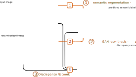

# Detecting the Unexpected via Image Resynthesis
Krzysztof Lis, Krishna Nakka, Pascal Fua, Mathieu Salzmann
**ICCV 2019**

[[article]](http://openaccess.thecvf.com/content_ICCV_2019/papers/Lis_Detecting_the_Unexpected_via_Image_Resynthesis_ICCV_2019_paper.pdf)
 [[poster]](https://liskr.net/pub/DetectingTheUnexpected_Poster.pdf)



## Installation

```bash
git clone https://github.com/cvlab-epfl/detecting-the-unexpected --recursive
```

Install libraries:
```bash
pip install numpy opencv-python-headless matplotlib h5py natsort imageio torch torchvision scipy tqdm tensorboard future ipython
```

To run notebook files:
```bash
pip install jupyterlab
```

## Trained weights

Download [weight files [2 GiB]](https://drive.switch.ch/index.php/s/xywBQNLoDxBVuxe/download)
and place them in `detecting-the-unexpected/exp` (or another location specified with env variable `DIR_EXPERIMENTS`).

## Directory structure

`detecting-the-unexpected`
* `src`
  * `a01_sem_seg` - semantic segmentation
  * `a04_reconstruction` - image synthesis from labels
  * `a05_differences` - discrepancy detector
  * `a05_road_rec_baseline` - the RBM autoencoder baseline method
* `exp` - trained weights (override location with env variable `DIR_EXPERIMENTS`)
  * `0120_BayesSegNet_BDD`
  * `0405_pix2pixHD512_nostyle_ctc_crop`
  * `0521_Diff_SwapFgd_ImgAndLabelVsGen_semGT`
  * ...
* `datasets` - or another location specified by env variable `DIR_DSETS`
  * `dataset_RoadAnomaly` - our dataset, [download here](https://www.epfl.ch/labs/cvlab/data/road-anomaly/)
  * `dataset_LostAndFound/1024x512` - [Lost and Found](http://www.6d-vision.com/lostandfounddataset) but downscaled by a factor of 2
* `data`
  * `joint_pipeline_example` - a few images from *Lost and Found*, to demonstrate the joint pipeline
  * `out` - default output location of the joint pipeline

## Running the pipeline

Please see the notebook [Exec_Joint_Pipeline.ipynb](Exec_Joint_Pipeline.ipynb):

```python
# specify input dataset, for example a directory with images
from src.datasets.dataset import DatasetImageDir
dset = DatasetImageDir(dir_root='data/joint_pipeline_example')
dset.discover()

# load the networks
from src.a05_differences.E1_article_evaluation import DiscrepancyJointPipeline
joint_pipeline = DiscrepancyJointPipeline()
joint_pipeline.init_semseg()
joint_pipeline.init_gan()
joint_pipeline.init_discrepancy()

# run and show results in notebook
joint_pipeline.run_on_dset(dset, b_show=True)
```

The notebook [Exec_Evaluations.ipynb](Exec_Evaluations.ipynb) can be used to the steps separately saving intermediate results.

## Contact
I am working to provide more examples and automated scripts.

For any additional information or requests, please contact [Krzysztof Lis](mailto:krzysztof.lis@epfl.ch).

